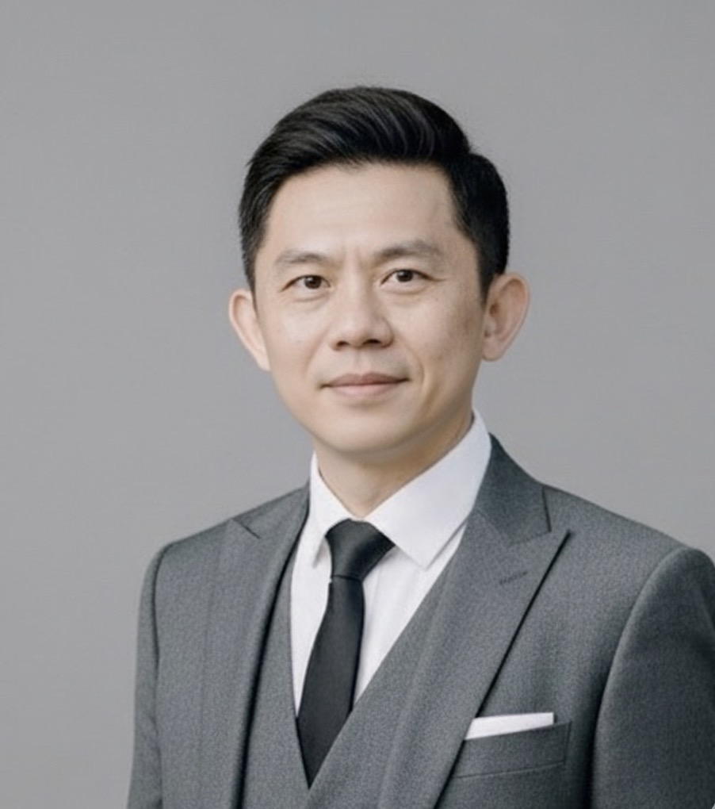
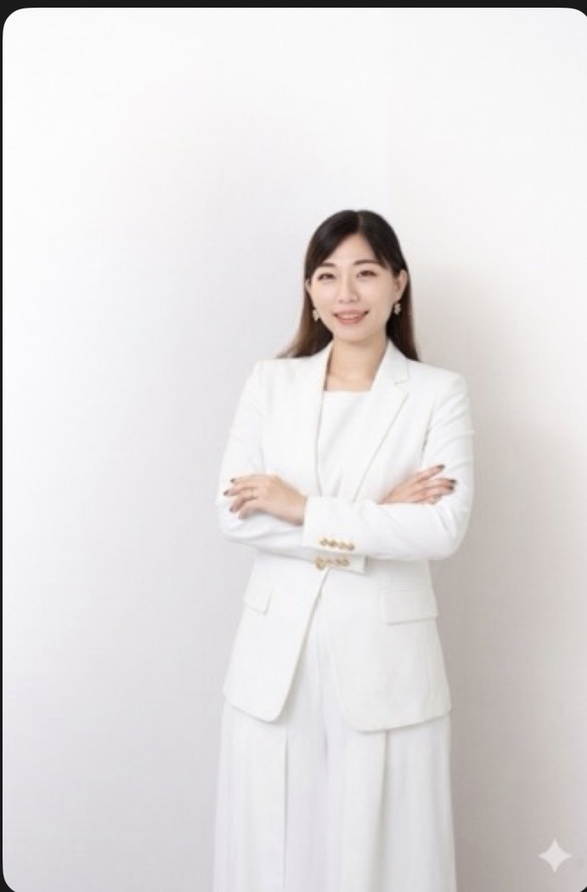

# Claude Code 最終整合指令 — 一次完成所有剩餘工作

**版本**：v3.0 FINAL
**產出日期**：2026-05-15 深夜
**使用方式**：複製整段「給 Claude Code 的完整指令」貼給 Claude Code，讓它自動跑完所有任務

---

## 您起床前的素材狀況

```
✓ index.html 已灌入 v2 首頁文案（已完成）
✓ about.html 已灌入 v2 關於我們頁文案（已完成，但需修正 3 處）
✓ services.html / contact.html / insights.html / news.html (骨架,待文案)
✓ en/index.html (英文版首頁骨架)
✓ insights/article-template.html (文章模板)

✓ 圖片素材已就位於 C:\Users\Johnny\Desktop\Agent\永旭專業網站\圖片\
   - logo2.png  (透明背景黑色圖,主 Logo)
   - 李宗穎.jpg (所長照片)
   - 林家均.jpg (負責人照片)

✓ 文案檔案:
   - 首頁完整文案_v2.md
   - 關於我們頁完整文案_v2.md
```

---

## 給 Claude Code 的完整指令（複製整段貼上）

```
請執行永旭事務所網站建置的最終整合任務,全程自動執行,
不要詢問我任何問題。完成後產出報告。

預估執行時間:60-90 分鐘
任務數量:14 個

═══════════════════════════════════════════════════
第一階段:照片與 Logo 整合
═══════════════════════════════════════════════════

【任務 1:整理圖片資源】

來源資料夾:C:\Users\Johnny\Desktop\Agent\永旭專業網站\圖片\

執行:
1. 在 assets/img/ 下建立 team/ 子資料夾(若不存在)
2. 複製檔案並重新命名:
   - 圖片/logo2.png → assets/img/logo.png
     (這是透明背景黑色 Logo,作為主 Logo)
   - 圖片/李宗穎.jpg → assets/img/team/lee-principal.jpg
   - 圖片/林家均.jpg → assets/img/team/lin-principal.jpg
   
3. 由於原 Logo 是黑色,而 header 是深藍底,需要建立白色版本:
   - 用 ImageMagick 或類似工具,把 logo.png 轉為白色版本
   - 命名為 logo-white.png
   - 存放於 assets/img/logo-white.png
   
   若無法自動產生白色版本,則:
   - 在 main.css 中對 .header-logo img 加上 CSS filter:
     filter: brightness(0) invert(1);
     (這會把黑色 Logo 轉為白色顯示)
   - footer 同樣處理

4. 製作 favicon:
   - 從 logo.png 製作 favicon.ico (32x32)
   - 製作 apple-touch-icon.png (180x180,深藍底 + 金色或白色 Logo)
   - 存放於專案根目錄
   - 在所有 HTML 的 <head> 加入相應 <link> 標籤

【任務 2:更新 header 與 footer 使用真實 Logo】

修改 assets/partials/header.html:
- 移除原本 SVG 文字 Logo「Y」的暫代版本
- 改用 
- 若 header 為深色背景,需確保 Logo 顯示為白色(用 filter 或白色版本)
- Logo 高度建議 40-50px,寬度自動

修改 assets/partials/footer.html 同樣處理。

【任務 3:整合主持人照片】

修改 about.html 的 Leadership 區塊:
- 李所長照片區:移除 👨‍💼 emoji,改用真實照片
  
  
- 林負責人照片區:移除 👩‍💼 emoji,改用真實照片
  

照片視覺風格:
- 採「圓角方型」(border-radius: 16-20px,符合使用者選擇 B)
- 桌機版照片尺寸:200x200px ~ 240x240px
- 手機版照片尺寸:160x160px ~ 180x180px
- 加上適度的陰影 box-shadow,提升質感

雙主持人視覺平衡:
- 兩張照片用同樣尺寸、同樣樣式
- 兩位 profile 卡片高度盡量一致
- 用 CSS Grid 或 Flexbox 確保桌機版並排,手機版垂直堆疊

═══════════════════════════════════════════════════
第二階段:about.html 三個修正
═══════════════════════════════════════════════════

【任務 4:林家均負責人補「核心專長」欄位】

在林負責人卡片的「實務經歷」之後、卡片結束之前,
新增「核心專長」欄位:

核心專長
▸ 專利申請與佈局
▸ 專利前案檢索與技術分析
▸ 商標申請與異議答辯
▸ 國際智財申請程序

排版風格與李所長的「技術專長」欄位一致,
確保雙主持人視覺份量平衡。

【任務 5:Global Reach 區塊內容擴充】

目前該區塊太簡化(只有標籤)。請依照
「關於我們頁完整文案_v2.md」中「區塊 6:國際合作網絡」
的完整內容重寫,包含:

【商標國際申請】
• 馬德里體系(涵蓋 130+ 會員國)
• 歐盟商標(EUTM,27 個歐盟成員國)
• 各國個案申請

【專利國際申請】
• PCT 國際專利(156 個成員國)
• 各國指定申請

【主要服務區域】
亞洲:台灣、香港、中國大陸、日本、韓國、
      新加坡、馬來西亞、泰國、越南、印尼、菲律賓
歐洲:歐盟、德國、英國、法國、西班牙、義大利
美洲:美國、加拿大、墨西哥、巴西、阿根廷
其他:澳洲、紐西蘭、中東主要國家、非洲主要市場

【量化敘述】
透過國際合作網絡,永旭累積服務眾多跨境企業客戶,
協助客戶在全球 50+ 國完成智財佈局,涵蓋國際運動品牌、
跨國藥業、海外科技公司等多元領域。

排版可用三欄式卡片(商標 / 專利 / 區域),
保留 [TODO: 國際服務地圖視覺化] 佔位符等未來放真實地圖。

【任務 6:Our Offices 內容補完】

每個辦公室卡片補上:
- Email: ysptoaa@gmail.com
- 交通資訊:
  
  高雄總部:
  • 高鐵左營站:車程約 10 分鐘
  • 捷運左營站:步行約 8 分鐘
  • 國道 1 號鼎金交流道:車程約 15 分鐘
  
  台北分所:
  • 台北車站:車程約 15 分鐘
  • 捷運西門站:步行約 12 分鐘
  • 捷運龍山寺站:步行約 10 分鐘

- 嵌入 Google Maps iframe:
  高雄:https://www.google.com/maps?q=高雄市左營區子華路116號2樓之3&output=embed
  台北:https://www.google.com/maps?q=台北市中正區莒光路47號1樓&output=embed
  iframe 寬度 100%,高度 300-400px

═══════════════════════════════════════════════════
第三階段:Emoji 改為 SVG Icon
═══════════════════════════════════════════════════

【任務 7:全站 Emoji 替換為 SVG Icon】

目前網站大量使用 Emoji(🏛🎓🌍🧬🍽⚙🎯🤝🔬⚖🌏🛡🏢🏙
📋™️©️🗺 等),不同系統字型呈現不一致,
精品事務所應改用線條風格 SVG icon。

執行:
- 從 Heroicons (https://heroicons.com/) 或 Lucide Icons 
  (https://lucide.dev/) 選擇對應線條風格 icon
- 用 inline SVG 嵌入 HTML
- 統一 stroke 顏色為主色 #1a2845 或強調色 #c8a96b
- 統一尺寸與線條粗細(stroke-width: 1.5 或 2)

Emoji 對應 Icon 建議:
- 🏛 政府機構 → building-library / landmark
- 🎓 學術 → academic-cap
- 🌍 國際 → globe / globe-alt
- 🧬 生技 → beaker / molecule
- 🍽 餐飲 → cake / utensils
- ⚙ 科技 → cog / cpu
- 🎯 品質 → target / star
- 🤝 服務 → users / handshake
- 🔬 技術 → beaker / microscope
- ⚖ 爭議 → scale / gavel
- 🌏 全球 → globe-asia / map
- 🛡 把關 → shield-check
- 🏢 總部 → building-office
- 🏙 分所 → building-storefront
- 📋 專利 → document-text / clipboard
- ™️ 商標 → trademark / badge-check
- ©️ 著作權 → copyright / library
- 🗺 地圖 → map

若 SVG 整合工程量過大,可採以下折衷:
- 主要區塊(三大服務、為什麼選擇、產業類別)的 icon 改為 SVG
- 次要區塊(信任條、辦公室)可保留 emoji
但建議優先全站替換以求視覺一致。

═══════════════════════════════════════════════════
第四階段:撰寫並建置剩餘 5 頁文案
═══════════════════════════════════════════════════

【任務 8:服務項目頁文案撰寫(services.html)】

頁面結構:
1. 頁面 Hero(標題:服務項目 / Our Services)
2. 服務快速導覽列(專利/商標/著作權/策略顧問,錨點連結)
3. 專利服務區塊
4. 商標服務區塊(本頁重點,內含「商標爭議與救援」強調框)
5. 著作權服務區塊
6. 智財策略顧問區塊
7. 服務流程(四步驟:諮詢→評估→執行→維護)
8. CTA 區

【專利服務內容】
標題:專利服務 Patent Services
副標:電子博士主持 × 工研院專利撰稿訓練

導語:
永旭事務所擁有電子博士主持、受過工業技術研究院完整專利
說明書撰稿訓練的專業團隊,能提供從技術解析、檢索分析、
說明書撰稿到專利佈局規劃的完整服務。

服務內容分四大類:

• 專利申請與撰稿
  - 發明、新型、設計專利說明書撰寫
  - 前案檢索與可專利性評估
  - 技術解析與 Claim 佈局策略
  - 國內外專利申請程序協助

• 國際專利申請
  - PCT 國際專利申請
  - 各國專利申請(美、日、中、歐、東南亞等 50+ 國)
  - 海外合作網絡協調

• 專利維護與爭議
  - 專利舉發、答辯協助
  - 專利侵權分析、迴避設計建議
  - 專利訴訟協助

• 專利商業化
  - 專利授權、移轉策略諮詢
  - 專利年費維護管理
  - 專利價值評估

技術專長領域:
電子電機｜半導體製程｜通訊光電｜機械工程
軟體系統｜生醫電子｜綠能科技

【商標服務內容 - 本頁重點】
標題:商標服務 Trademark Services
副標:逾 25 年商標實務 × 多次榮獲前 20 大申請量

導語:
永旭事務所擁有逾 25 年商標實務積累,曾多次榮獲台灣
商標申請量前 20 大事務所殊榮。從前端的查名檢索、
申請策略,到核駁爭取、異議答辯、權利救濟,提供商標
全生命週期的精緻服務。

服務內容分四大類:

• 商標申請與佈局
  - 國內商標申請
  - 國際商標申請(馬德里、各國個案申請)
  - 商標查名與可註冊性評估
  - 多類別佈局策略規劃
  - 商標識別性強化建議

• 商標爭議與救援【視覺強調框!深藍底 + 金色邊框】
  - 核駁先行通知答辯
  - 申復、訴願、行政訴訟
  - 異議、評定、廢止程序代理
  - 將「困難商標」成功取得核准
  - 識別性論述與舉證策略

• 商標權維護與運用
  - 商標延展、變更登記
  - 商標授權、移轉
  - 仿冒取締與侵權警告
  - 商標監視服務

• 商標訴訟與調處
  - 侵權訴訟協助
  - 智慧財產法院案件
  - 商標調處、和解協商

特別補充段落:
李宗穎所長擅長處理「不可能核准」的困難商標。
透過深入分析商標識別性、論述使用歷史、研究先前判決,
許多被核駁的商標經策略性申復後成功取得核准。
李所長亦長期擔任業界商標爭議的諮詢顧問。

【著作權服務內容】
標題:著作權服務 Copyright Services
副標:著作權代理師主持

導語:
李宗穎所長具備著作權代理師資格(臺灣經濟科技發展研究院
登錄),提供完整的著作權專業服務,協助客戶管理創作成果
的法律權益。

服務內容:
• 著作權登記申請
• 著作權授權合約撰寫
• 著作權侵權鑑定
• 數位著作保護策略
• 著作權爭議處理

【智財策略顧問內容】
標題:智財策略顧問 IP Strategy Consulting
副標:超越單一案件,為企業打造長期智財佈局

導語:
智財不只是申請,更是企業創造長期競爭力的核心資產。
永旭以 25 年實務積累,為客戶提供策略層級的智財諮詢。

三大顧問服務:

• 智財盤點與診斷
  - 現有智財資產盤點
  - 競爭對手智財分析
  - 智財風險評估

• 智財佈局規劃
  - 國內外申請策略
  - 跨國市場保護佈局
  - 申請時程與預算規劃

• 智財價值化
  - 智財授權策略
  - 智財商業化建議
  - 智財價值評估

【服務流程(四步驟)】
01 免費初步諮詢
   了解需求、評估保護方向,專業顧問提供初步建議,
   完全免費。

02 評估與策略規劃
   進行前案檢索與可行性分析,量身擬定最佳的申請策略。

03 代理申請執行
   撰寫申請文件、提出申請,全程追蹤審查進度並即時回報。

04 長期維護管理
   權利獲准後持續管理,到期提醒、年費繳納、侵權監控
   一條龍服務。

【服務頁 SEO Meta】
<title>服務項目 ｜ 專利・商標・著作權三大智財服務 — 永旭智慧財產事務所</title>
<meta name="description" content="永旭智慧財產事務所服務涵蓋專利申請、商標爭議救援、著作權登記、智財策略顧問。電子博士主持,工研院專利撰稿訓練,前 20 大商標實績。">

═══════════════════════════════════════════════════

【任務 9:聯絡我們頁文案撰寫(contact.html)】

頁面結構:
1. 頁面 Hero(標題:聯絡我們 Contact Us)
2. 雙辦公室卡片(高雄總部 / 台北分所)
3. 聯絡表單
4. 服務時間
5. Google Maps 嵌入兩個地點

【聯絡資訊】
高雄總部
高雄市左營區子華路 116 號 2 樓之 3
TEL:(07) 345-3388
FAX:(07) 345-2122
Email:ysptoaa@gmail.com

台北分所
台北市中正區莒光路 47 號 1 樓
TEL:(02) 2579-6961
FAX:(02) 2579-6932
專線:0956-264-578(台北所負責人直撥)
Email:ysptoaa@gmail.com

【服務時間】
週一至週五:09:00 - 18:00
週六:預約諮詢制
週日及國定假日:休息

如有緊急智財事宜需處理,歡迎致電台北所專線
0956-264-578 進行預約。

【聯絡表單欄位】
- 姓名 (必填)
- 公司/機構名稱 (選填)
- 聯絡電話 (必填)
- Email (必填)
- 諮詢類型 (複選框):
  □ 專利申請
  □ 商標申請
  □ 著作權服務
  □ 商標爭議處理
  □ 專利爭議處理
  □ 國際智財申請
  □ 智財策略顧問
  □ 其他
- 諮詢內容 (必填,多行文字)
- 隱私聲明同意勾選 (必填)
- 送出按鈕

【表單後端】
先用 EmailJS 預設整合,API key 預留空字串等使用者填入。
表單送出後跳轉至 contact.html?status=success 顯示成功訊息。

【聯絡頁 SEO Meta】
<title>聯絡永旭 ｜ 高雄總部・台北分所 — 永旭智慧財產事務所</title>
<meta name="description" content="永旭智慧財產事務所聯絡資訊。高雄總部 (07) 345-3388,台北分所 (02) 2579-6961。免費諮詢,專業評估您的智財保護需求。">

═══════════════════════════════════════════════════

【任務 10:智財知識首頁文案撰寫(insights.html)】

頁面結構:
1. 頁面 Hero(標題:智財知識 IP Insights)
2. 分類篩選(全部 / 專利 / 商標 / 著作權 / 國際智財)
3. 文章列表(網格式)
4. 側邊欄(諮詢 widget、FAQ)

【頁面副標】
深入淺出的智財知識,幫助您為創新與品牌做出最明智的
保護決策。

【先建立 6 篇文章卡片】(實際內容由任務 11 寫 3 篇,
其他 3 篇用「即將上線」標籤暫代)

文章 1:申請發明專利前,為什麼一定要做前案檢索?(專利)
文章 2:商標被核駁先行通知,真的就沒救了嗎?(商標)
文章 3:著作權自動產生,為什麼還需要辦理著作權登記?(著作權)
文章 4:馬德里國際商標 vs 個別國家申請:該怎麼選?(國際)
文章 5:商標識別性論述:讓困難商標逆轉勝的關鍵(商標)
文章 6:PCT 國際專利申請完整指南(專利)

文章 1-3:連結到 insights/article-1.html、article-2.html、article-3.html
文章 4-6:用「即將上線」標籤,連結停用

【FAQ 區塊】(手風琴展開)
Q1: 商標申請大概需要多久時間?
A: 台灣商標審查期間約 6-8 個月,通過後核發證書約 1 個月。
   永旭會在每個關鍵節點主動通知您進度。

Q2: 我的商標被核駁了,還有救嗎?
A: 商標核駁不是終局決定。透過申復程序、識別性論述、
   使用證據舉證,許多被認為不可能核准的商標仍有機會。
   永旭有豐富的核駁救援經驗。

Q3: 專利申請需要準備什麼資料?
A: 基本上需要技術說明、發明人資料、申請人資料。
   永旭會提供發明揭露書範本,協助您整理出完整的技術資料。
   初次諮詢完全免費。

═══════════════════════════════════════════════════

【任務 11:撰寫 3 篇示範文章】

複製 insights/article-template.html 三次,
建立 insights/article-1.html、article-2.html、article-3.html

【文章 1:申請發明專利前,為什麼一定要做前案檢索?】
- 分類:專利知識
- 預估閱讀:5 分鐘
- 字數:1500-2000 字
- 大綱:
  H2 - 什麼是前案檢索?
  H2 - 不做前案檢索的三大風險
    H3 - 風險 1:申請被駁回,規費白繳
    H3 - 風險 2:保護範圍縮水
    H3 - 風險 3:核准後仍可能被舉發
  H2 - 前案檢索的範圍與方法
  H2 - 自行檢索 vs 委託專業事務所
  H2 - 永旭的前案檢索服務
- 結尾 CTA:預約免費諮詢

【文章 2:商標被核駁先行通知,真的就沒救了嗎?】
- 分類:商標知識
- 預估閱讀:6 分鐘
- 字數:1800-2300 字
- 大綱:
  H2 - 什麼是核駁先行通知?
  H2 - 收到核駁通知後的三個選項
  H2 - 申復策略:三大論述方向
    H3 - 識別性論述
    H3 - 使用證據舉證
    H3 - 商品服務區隔
  H2 - 案例分析:困難商標如何逆轉勝(匿名化處理)
  H2 - 永旭的核駁救援服務
- 結尾 CTA:預約免費諮詢

【文章 3:著作權自動產生,為什麼還需要辦理著作權登記?】
- 分類:著作權知識
- 預估閱讀:4 分鐘
- 字數:1200-1500 字
- 大綱:
  H2 - 著作權的自動產生原則
  H2 - 不登記的風險:舉證困難
  H2 - 著作權登記的法律效力
  H2 - 哪些情況特別建議登記?
  H2 - 永旭的著作權服務
- 結尾 CTA:預約免費諮詢

文章撰寫風格:
- 用口語化說明法律概念
- 多用實際例子(可虛構但合理)
- 結構分明,有小標、條列
- 避免過度法律術語
- 中文標點全形
- 文末「關於永旭」作者框 + CTA 按鈕

═══════════════════════════════════════════════════

【任務 12:新聞動態頁文案撰寫(news.html)】

頁面結構:
1. 頁面 Hero(標題:新聞動態 News & Updates)
2. 分類(全部 / 事務所動態 / 演講活動 / 智財新聞)
3. 新聞列表

【事務所動態 2 則】

1. 永旭智慧財產事務所網站全新改版上線
   日期:2026-05-15
   內容:
   永旭以「精品智財服務」為核心,推出全新形象網站,
   呈現 25 年實務積累與電子博士主持的專業深度。新網站
   整合專利、商標、著作權三大服務,提供更直觀的智財
   知識專欄與便捷的諮詢管道。
   
2. 永旭累積服務超過 50 家跨境企業客戶
   日期:2026-04-20
   內容:
   永旭透過歐盟商標、馬德里體系、PCT 國際專利等機制,
   服務範圍涵蓋兩岸三地、東南亞、歐美主要市場,協助
   客戶完整建立全球智財佈局。

【演講活動 3 則】

1. 李宗穎所長受邀於大專院校演講「商標識別性論述策略」
   日期:2026-04-10
   內容:
   李所長以多年商標爭議實戰經驗,分享如何透過識別性
   論述為困難商標爭取核准的策略性思考。

2. 李宗穎所長受邀於企業內訓談「中小企業智財佈局實務」
   日期:2026-03-15
   內容:
   針對中小企業主常見的智財盲點,李所長提供從商標
   申請、專利保護到著作權管理的完整實務建議。

3. 李宗穎所長受邀於社會團體分享「智財保護觀念推廣」
   日期:2026-02-20
   內容:
   李所長長期致力於智財保護觀念推廣,本次活動深入
   說明為什麼智財是企業最重要的無形資產。

【智財新聞 2 則】

1. 台灣商標申請量持續成長,2024 年突破歷史新高
   日期:2026-01-15
   內容:
   智慧財產局公布最新統計,顯示台灣企業對品牌保護
   意識持續提升,商標申請件數創歷史新高。專家分析,
   隨著新創與電商蓬勃發展,商標保護需求預計將持續
   攀升。

2. 馬德里體系新增會員國,海外商標佈局更便利
   日期:2025-12-10
   內容:
   WIPO 公告馬德里聯盟新增會員國,台灣企業透過此機制
   可保護的市場進一步擴大至 130+ 國,為國際品牌佈局
   提供更便利的途徑。

═══════════════════════════════════════════════════

【任務 13:英文版翻譯】

優先順序:
1. en/index.html(首頁,已有骨架,需更新內容)
2. en/about.html(關於我們,建立檔案)
3. en/services.html(服務項目,建立檔案)
4. en/contact.html(聯絡我們,建立檔案)

翻譯原則:
- 不是直譯,是「英文母語使用者讀起來自然」的版本
- 中文有的業界含蓄表達可改為更直接的英文表述
- 標題標語可調整為更適合國際客戶的角度
- 保留所有官方資格與認證的英文名稱

英文主標建議:
H1: "Ph.D.-led IP Excellence Since 2010"
Subtitle: "Where Technical Depth Meets Trademark Expertise"
Hero Description: 
"With 25 years of IP practice and 16 years as a boutique firm, 
YSIPO delivers patent drafting, trademark prosecution, and 
copyright services with the personal attention only a Principal-
led firm can provide."

英文版核心訊息:
- Ph.D. in Electronic Engineering, principal-led
- ITRI patent specification drafting training
- Top 20 trademark filing firm in Taiwan
- 25 years of practice (since 2001)
- 16 years as YSIPO (since 2010)
- Bilingual service across Asia-Pacific markets
- Personal attention to every case

李所長英文 Bio:
Dr. Johnny Lee (Tsung-Ying Lee) holds a Ph.D. in Electronic 
Engineering from National Kaohsiung University of Science and 
Technology. He is among Taiwan's few IP professionals combining 
doctoral-level technical expertise, ITRI patent drafting training, 
trademark agent credentials, and registered copyright agent status.

Beginning his IP career in 2001 at one of Taiwan's leading IP 
firms, Dr. Lee founded YSIPO in 2010 to bring boutique-firm 
personal service together with large-firm professional standards.

林負責人英文 Bio:
Esmé Lin (Chia-Chun Lin), Principal of YSIPO's Taipei office, 
holds a Master's degree from National Taiwan University of 
Science and Technology's Graduate Institute of Patent. She is 
a registered Trademark Agent with dual IP Professional 
Certifications (Patent Technical Engineering and Patent Search 
& Analysis), bridging technical patent expertise and trademark 
prosecution.

═══════════════════════════════════════════════════

【任務 14:全站視覺微調與最終檢查】

【視覺一致性】
針對所有 7 個中文頁面 + 4 個英文頁面進行統一檢查:
- 字級層級一致(H1/H2/H3 統一)
- 段落間距協調
- 按鈕樣式統一
- 卡片陰影與圓角一致
- 響應式排版(桌機/平板/手機)無破版
- 雙主持人卡片視覺平衡

【全形/半形標點】
- 中文內文使用全形標點(,。「」)
- 數字、英文與單位之間用半形空白
- 英文版全部使用半形

【SEO 完整性】
每頁確認:
- <title> 不超過 60 字元
- <meta description> 不超過 160 字元
- Open Graph 標籤完整
- JSON-LD 結構化資料正確
- 內部連結正常運作

【響應式測試】
模擬以下尺寸:
- 桌機 1920x1080 / 1440x900
- 平板 768x1024
- 手機 375x667(iPhone)/ 414x896

【無障礙】
- alt 屬性完整
- focus-visible 樣式
- 對比度 WCAG AA

═══════════════════════════════════════════════════

完成後請產出:

【FINAL_REPORT_v3.md】
- 每個任務(共 14 個)完成狀態
- 修改的檔案清單
- 遇到的困難與解決方案
- 預估整體完成度(目標 95%+)
- 截圖建議(用 Chrome F12 「Capture full size screenshot」)
- 還需使用者提供的事項清單

【REMAINING_TODO_v3.md】
列出「使用者起床後需要決定或提供」的事項,
排序為:必要 / 重要 / 加分。

═══════════════════════════════════════════════════

執行注意事項:
1. 全程自動執行,不要詢問使用者
2. 文案撰寫遵守 PROJECT_BRIEF.md 與 v2 文案的所有原則:
   - 不虛構員工
   - 不列具名客戶
   - 不寫精確案件數
   - 用「撰寫」不用「代理」(專利相關)
   - 著作權代理師標示發證單位
3. 全形/半形標點符合中文寫作慣例
4. SEO Meta 為每頁客製化
5. JSON-LD 結構化資料完整
6. 響應式設計檢查

開始執行!從第一階段照片整合開始,
依序執行 14 個任務,中間不要停頓。
```

---

## 使用者起床後的步驟（只有兩件事）

### 步驟 1：把指令貼給 Claude Code

開啟「給ClaudeCode的最終整合指令_v3.md」，**複製整段「給 Claude Code 的完整指令」**（從 ``` 開始到 ``` 結束），貼到 Claude Code 視窗。

### 步驟 2：去做別的事（不需要等）

Claude Code 會跑 60-90 分鐘，跑完會停下來不吃 token。

跑完後您醒來看：

1. `FINAL_REPORT_v3.md`（完成狀況）
2. `REMAINING_TODO_v3.md`（您要處理的事）
3. 用 VS Code Live Server 預覽
4. 截圖傳給我

---

## 安心睡覺，明天見

```
跑完後您會看到:
✓ 真實照片整合到網站(您和林負責人)
✓ 真實 Logo 替換掉 SVG 文字暫代版
✓ Favicon 完成
✓ 關於我們頁三個問題修正
✓ Emoji 改為 SVG icon(視覺更精緻)
✓ 服務項目頁完整文案 + 商標爭議救援強調框
✓ 聯絡我們頁完整文案 + 表單 + Google Maps
✓ 智財知識首頁 + 6 篇文章卡片 + FAQ
✓ 3 篇真實示範文章(每篇 1500-2300 字)
✓ 新聞動態頁 + 7 則預設內容
✓ 英文版 4 頁翻譯
✓ 全站視覺一致性檢查

預估完成度:95%

剩下的 5% 需要您起床後決定:
- 演講機構是否要更具體
- 表單後端(EmailJS)的 API key
- Google Analytics 埋碼
- Logo 細部調整
```

---

**晚安。明天見。**

明天您醒來,我們再一起檢視成果,做最後微調。
